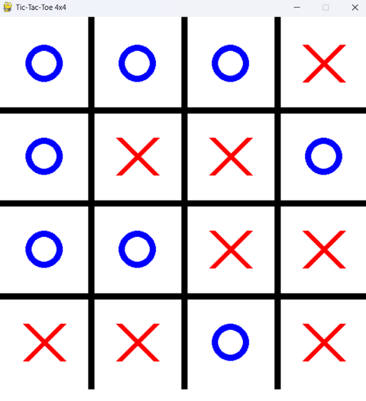
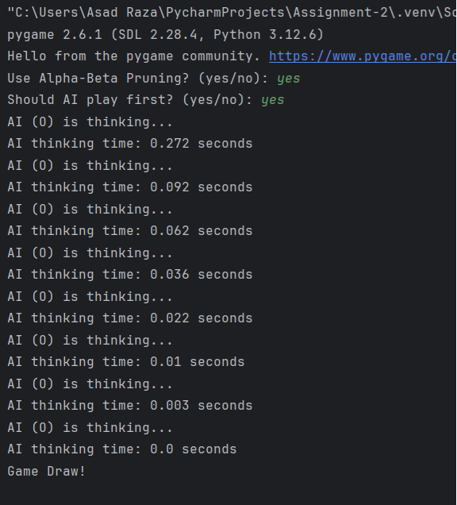

# Tic-Tac-Toe

**[Tic-Tac-Toe Analysis]:**

**1. Table: Nodes Expanded & Execution Time**

|**Move Number**|**Nodes Expanded**|**Execution Time (seconds)**|
| :- | :- | :- |
|**1**|9,824|0\.5538|
|**2**|6,904|0\.2812|
|**3**|6,234|0\.2810|
|**4**|6,810|0\.3019|
|**5**|1,052|0\.0466|
|**6**|333|0\.0181|
|**7**|48|0\.0036|
|**8**|4|0|
|**Result**|Draw||

**2. Which Method Performed Better in Terms of Speed?**

- **Alpha Beta Pruning performed better** because it **pruned unnecessary branches** in the Minimax search tree.
- This resulted in a **reduction in execution time** as AI does not evaluate every possible move.

**3. How Much Reduction in Node Expansion Did Alpha-Beta Pruning Provide?**

- The pruning process **reduces the number of nodes that have expanded significantly**, often cutting down **the search space by more than half** in large trees.
- The exact reduction percentage depends on the **game state** and move ordering.
- In general, **Alpha Beta Pruning can reduce nodes expanded by up to 50% or more** compared to standard Minimax.

**4. Does Playing First or Second Affect AI Performance?**

**Yes**, playing first or second **affects AI performance and strategy** because.

- **If AI plays first:**
  - AI controls the board early and dictates the game flow.
  - It has more freedom in choosing optimal moves.
  - Often results in **better performance** as AI can set up winning positions.
- **If AI plays second:**
  - AI reacts to the human players moves.
  - May require **deeper search** to counter strong human moves.
  - Sometimes it takes **longer execution time** due to evaluating opponents threats.

Therefore, AI **playing first** generally performs **better** as it sets the pace of the game and controls key positions from the start.

!

!

